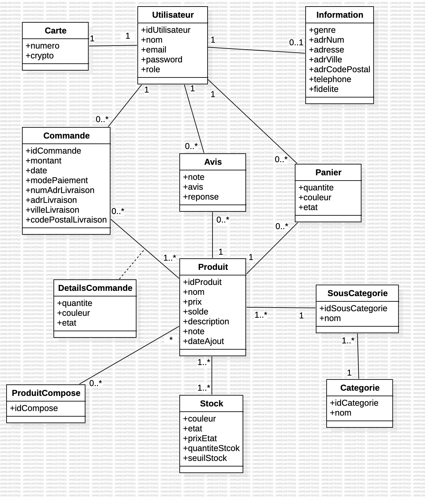

= Documentation Technique site Web
:toc:
:toc-title: Sommaire

Version du site : 6 +
Date : 10/01/2024 +
Equipe : 1B-4 +
Client : Front Maker +
Projet : Site Web e-commerce 

<<<

== 1. Description du Projet
=== a) Equipe

Scrum Master : https://github.com/bastos-rcd[Bastien Record] +
Product Owner : https://github.com/walaedinesekoub[Waleidine Sekoub] +
Développeurs : https://github.com/HugolaLicorne[Hugo Berdinel], https://github.com/technox023[Éliot Desportes], https://github.com/GuiSamSamTei[Guilherme Sampaio] +

=== b) Contexte du projet

Front Market est une entreprise spécialisée dans la distribution de produits électroniques reconditionnés. Notre mission est de rendre la technologie accessible à tous, en offrant une gamme diversifiée de produits électroniques de bonne qualité, le tout à des tarifs abordables. Chez Front Market, nous pensons fermement que la technologie doit être accessible au grand public.

=== c) Objectifs du projet

L’objectif est de créer un site web en accord avec la charte graphique de l’entreprise, qui proposera des produits reconditionnés. Front Market et ses produits s’adressent à tout type de clients, aussi bien pour des usages professionnels ou particuliers.

== 2. Architecture

=== a) Architecture Générale

Le site est accessible depuis l'adresse suivante : http://193.54.227.208/~saephp04

Le code en HTML5, CSS et PHP est herbergé sur un serveur, et la connexion à la base de données se fait en MySQL.

=== b) Ressources externes

Réferrez-vous à la https://github.com/IUT-Blagnac/sae-3-01-devapp-g1b-4/blob/master/Documentation/DocUser_web.adoc[documentation utilisateur] pour connaître les différentes fonctionnalités du point de vue de l'utilisateur.

=== c) Arborescence

* `include` +
  Ce dossier contient les différentes ressources qui seront inclues dans les pages du site web
** `img` +
    Ce dossier contient les différentes images utilisées sur la totalité du site
*** `etoile` +
      Ce dossier contient les différentes images correspondants à la note attribuée à un produit sous forme d'étoiles
*** `produit` +
      Ce dossier contient les différentes images des produits présents sur le site
** `connect.inc.php` +
    Permet d’établir la connexion à la BD
** `footer.php` +
    Permet l'affichage du pied de page
** `header.php` +
    Permet l'affichage du haut de page
** `style.css` +
    Feuille de style pour le site web
* `boutique.php` +
  Page boutique affichant tous les produits en vente sur le site web
* `deconnexion.php`
  Page qui permet de traiter la déconnexion et redirige vers la page `index.php`
* `etoile.php`
  Fichier contenant un fonction en php permettant d'afficher la note sous forme d'étoile
* `index.php`
  Page d'accueil affichant les produits récents et les meilleures notés
* `produit.php`
  Page produit affichant le produit avec ses détails avec possibilité d'ajout dans le panier

*AJOUTER LE RESTE EN FIN DE PROJET*

=== d) Diagramme de classe des données (BD)

Voici le diagramme de classe structurant la base de données :

== 3. Fonctionnalités

=== a) index.php
* La page d'accueil du site. C'est la plus importante du site, puisqu'elle permet l'accès à la plupart du site directement, elle permet d'afficher une séléction de produits desquels les clients doivent en consulter les détails rapidement et efficacement.
** `<section class="produit-accueil">` On crée une première section qui contiendra les produits les plus récents:
*** `$req_new_product = $conn->prepare("SELECT idProduit, nom, prix, solde, note, dateAjout FROM Produit ORDER BY dateAjout DESC;");` Il nous faut récupèrer tous les produits par ordre d'insertion décroissant.
*** `for ($i = 0; $i < 5; $i++)` Ensuite, pour les cinq premiers (les plus nouveaux):
**** `echo '<a href="produit.php?idProduit=' . $produit['idProduit'] . '">';` On crée une zone affichant l'image reliée au produit, son prix, et sa note sur cinq donnée par la fonction etoile.php.
** `<section class="produit-accueil">` On affichera aussi une page qui affichera les meilleures ventes (les produits les mieux notés).
*** `$req_best_product = $conn->prepare("SELECT idProduit, nom, prix, solde, note, dateAjout FROM Produit ORDER BY note DESC;");` Au lieu de chercher les produits par date d'insertion, on cherchera en fonction de sa note.
*** Pour le reste de la section, elle est identique à la première partie.

=== b) boutique.php
* La page boutique.php est similaire à la page d'accueil puisqu'elle permet d'afficher des produits mais c'est cette page qui permet de faire des recherches concrètes de produits en fonction des prix et/ou des marques.
** `<form class="search" action="boutique.php" method="post">` On commence par mettre un formulaire permettant aux clients de filtrer sa recherche.
** `<section class="produit-boutique">` On crée une première section contenant les produitrs individuels.
** La méthode d'affichage des produits est la même que pour la page d'accueil.

=== c) etoile.php
* La fonction etoile est une fonction PHP qui prend en paramètre une note sous forme de nombre à virgule flottante (float) et affiche une image d'étoile correspondante en fonction de la plage de notes.
** `function etoile(float $note)` Afficher une image d'étoile en fonction d'une note fournie en paramètre.

=== d) connexion.php
* La page connexion.php sert a afficher deux formuler un d'inscrption ou lutilisateur poura rentre ses donne afin de crree son compte et un autre formulaire de connexion ou lutilisateur ne doit rentre que sont adress mail et sont mot de passe pour ce connecter 
** `<form action="TraitCreation.php" method="post" id="inscription">` Un formulaire d'inscription est présenté avec des champs tels que nom, prénom, genre, email, mot de passe, téléphone, et adresse. Le formulaire est envoyé à "TraitCreation.php" en utilisant la méthode POST.
** `	<form action="TraitConnexion.php" method="post" id="connexion">` Un formulaire de connexion est également inclus avec des champs pour l'email, le mot de passe, et une option "Se souvenir de moi". Le formulaire est envoyé à "TraitConnexion.php" en utilisant la méthode POST.
** `<input type="submit" name = "Valider2" value="Se connecter">` Cette ligne crée un bouton "Se connecter" dans un formulaire HTML. Lorsque l'utilisateur clique sur ce bouton, les données du formulaire sont soumises au serveur pour être traitées. La valeur "Valider2" est associée à ce bouton lors de la soumission du formulaire.

=== e) TraitCreation.php
* La page TraitCreation `produit.php` se charge de créer un client et de l'insérer dans la base de données.
** `$nom = htmlentities("".$_POST['prenom']." ".$_POST['nom']); ...` On récupère les données du formulaire et on établit des variables comme la fidélité ou le rôle (client)
** `$pattern = "/^(?=.*[a-z])(?=.*[A-Z])(?=.*\d)(?=.*[@$!%*?&])[A-Za-z\d@$!%*?&]{8,16}$/";` On vérifie la validité du formulaire passant plusieurs regex dans les différents champs:
*** Mot de passe: Entre 8 et 16 caractères, dont une minuscule, une majuscule, un caractère spécial et un chiffre.
*** Telephone: 10 chiffres, commençant par 0, qui peuvent être groupés de 2 en 2 puis séparés par des tirets, des points ou des espaces
*** Email: Même si le champ du formulaire demande un email et ne permet pas la soumission du formulaire si ce champ ne contient pas un email, on revérifie dans cette page au cas où.
*** Genre: On vérifie que le genre est saisie
*** Code Postal: 5 chiffres consécutifs, aucun espace toléré
*** Numéro (adresse): De 1 à 3 chiffres consécutifs, aucun espace toléré
*** Nom de la rue: De 1 à 30 caractères permis (minuscules, majuscules, chiffres, tirets, virgules, points, apostrophes, espaces)
*** Nom de la ville: De 1 à 15 caractères permis (pareil que pour le nom de la rue)
** De façon préalable au traîtement, on crypte le mot de passe (`$mdp = hash("sha256", $mdp);`).
** Avec le formulaire vérifié, on peut passer au "vrai" traîtement.
** `$requete = $conn -> prepare("SELECT email FROM Utilisateur WHERE email = :email");` En premier, on vérifie que l'email associé au compte qu'on veut créer n'est pas associé à un autre client déjà inscrit.
** Si le résultat de la requête n'est pas vide (donc l'email existe déjà dans la base de données), on va afficher une alerte d'erreur et vider les champs du formulaire.
** Dans le cas contraire, on pourra passer à l'insertion dans la base. (`$requete = $conn -> prepare("CALL AjouterClient(:nom, :email, :mdp, :genre, :adrNum, :adresse, :ville, :codePostal, :telephone);");`).
** Suite à cela, on récupère son idUtilisateur (`$requete = $conn -> prepare("SELECT idUtilisateur FROM Utilisateur ORDER BY idUtilisateur DESC LIMIT 1");`)...
** ...Et on initialise la session (`$_SESSION['connected'] = $idUtilisateur['idUtilisateur'];
                                    $_SESSION['role'] = $role;`); 
** Enfin, on redirige le client à sa page compte (`echo 'window.location.replace("client.php");';`).

=== f) TraitConnexion.php
* La page TraitConnexion est similaire à TraitCreation mais elle est faite pour des comptes déjà existants.
** `$email = htmlentities($_POST['email']);` Premier, on récupère les informations du formulaire.
** `$mdp = hash("sha256", $mdp);` On crypte le mot de passe saisi.
** `$requete = $conn -> prepare("SELECT * FROM Utilisateur WHERE email = :email");` On récupère les informations du client.
** Si on ne trouve pas un compte avec l'email donné, on renverra l'utilisateur à la page connexion.php afin qu'il saisisse son vrai email ou qu'il crée son compte.
** On vérifie que le mot de passe soit correct (`if ($emailBDD['password'] == $mdp)`).
** Si le mot de passe est le bon, on initialise la session (`$_SESSION['connected'] = $emailBDD['idUtilisateur'];
        $_SESSION['role'] = $emailBDD['role'];`).
** Si l'utilisateur veut qu'on se souvienne de lui, on crée une cookie contenant son identifiant. Sinon, on cherche s'il a une cookie et on la fait périmer si on la trouve.
** `if($emailBDD['role'] == 'admin')` On teste son rôle dans le site. S'il est administrateur, le site va envoyer l'utilisateur à la page d'administration. Si l'utilisateur est un client, le site le renvoie à la page d'information de client.

=== g) client.php
* Modification des informations du compte utilisateur sur le site Front Market.
** `require_once('include/connect.inc.php');` Inclusion du fichier de connexion à la base de données
** `echo '<form action="TraitModification.php" method="post" id="modification">';` Formulaire de modification des informations du compte

=== h) TraitModification.php
* Cette page traite le formulaire qui se trouve dans client.php. Il permet au client de modifier ses informations.
** `$nom = htmlentities($_POST['nom']);` On commence par récupérer les données du formulaire.
** `if($_POST['passwordA']!="" || $_POST['passwordB']!="")` En testant si un des deux champs du formulaire reliés au mot de passe, on peut savoir si le client veut changer son mot de passe. On a défini au prélable un booléen qui nous permet de savoir si l'utilisateur veut change son mot de passe ou pas qui est initialisé à `false`. Tout le code PHP à l'intérieur de cet ìf` est groupé en trois tests:
*** `if(($_POST['passwordA']!="" && $_POST['passwordB']=="") || ($_POST['passwordA']=="" && $_POST['passwordB']!=""))` Avec cet `ìf` on teste si uniquement un des deux champs a été rempli. Si c'est le cas, on affiche une alerte et on annule la modification. Sinon, on passe au suivant test.
*** `if (isset($_POST['passwordA']) && isset($_POST['passwordB']) && $mdp == $mdp2)` Ce test nous permet de vérifier que le mot de passe actuel et le nouveau sont identiques.
*** `$pattern = "/^(?=.*[a-z])(?=.*[A-Z])(?=.*\d)(?=.*[@$!%*?&])[A-Za-z\d@$!%*?&]{8,16}$/";` Pour finir, on vérifie que le nouveau mot de passe correspond aux normes qu'on a imposé. Si le test ne passe pas, on rappelle les règles à l'utilisateur et on annule la modification.
** Si ces trois tests sont passés avec succés, on indique au code qu'on va modifier le mot de passe (`$mdpRecherche = true;`).
** Suite à cela, on revérifie toutes les informations du formulaire comme dans le formulaire de création de compte ( https://github.com/IUT-Blagnac/sae-3-01-devapp-g1b-4/edit/master/Documentation/DocTech_web.adoc#e-traitcreation-php[voir TraitCreation])
** Si tous les tests sont passés, on procède à la modification.
** Si on va modifier le mot de passe, on va faire cette requête `$requete = $conn -> prepare("CALL ModifierClient(:idUtilisateur, :nom, :email, :mdp, :genre, :adrNum, :adresse, :adrVille, :adrCodePostale, :telephone)");` avec le paramètre `:password` contenant le nouveau mot de passe et sinon le paramètre sera `NULL`.
** Le client est ensuite renvoyé à `client.php`.

=== i) consultationCommande.php
* Cette page permet à l'utilisateur de consulter les commandes effectuées. 
** `$req_commande = $conn->prepare("SELECT C.idCommande,C.montant, C.dateCommande, C.modePaiement, C.adrNumLivraison, C.adrLivraison, C.codePostaleLivraison FROM Commande C WHERE C.idUtilisateur = :idUser ORDER BY dateCommande DESC;");` On récupere les commandes faites par l'utilisateur.
** `while ($commande = $req_commande->fetch())` Pour chaque commande trouvée, on affiche les informations reliées telles que le montant total et la date.

=== j) produit.php
* La page produit `produit.php` permet d'afficher en détail un produit particulier, avec la possibilité d'ajouter le produit au panier et de laisser des avis. Elle interagit avec la base de données pour récupérer les détails du produit, les avis des utilisateurs, et permet aux administrateurs de répondre aux avis.
** `require_once('etoile.php');` Contient une fonction pour afficher les étoiles de notation.
** `$req_product->execute(["idProduit" => htmlentities($_GET["idProduit"])]);` Les détails du produit sont récupérés de la base de données en fonction de l'identifiant de produit fourni dans l'URL.
** `if ($count == 0) { ... }` Si le produit n'existe pas, une alerte JavaScript est affichée, et l'utilisateur est redirigé en arrière.
** L'interface utilisateur affiche l'image, le nom, la marque, la catégorie, la note, le prix, et offre la possibilité d'ajouter le produit au panier.
** `$req_avis->execute(["idProduit" => htmlentities($_GET["idProduit"])]);` Les avis des utilisateurs sont récupérés de la base de données et affichés, y compris la possibilité pour les administrateurs de répondre aux avis.
** `if (isset($_SESSION['connected']) && $_SESSION['role'] == "client") { ...  $req_avis->execute(["idProduit" => htmlentities($_GET["idProduit"]), "idUtilisateur" => htmlentities($_SESSION['connected'])]); ... }` Les utilisateurs connectés peuvent laisser des avis via un formulaire s'ils n'ont pas déjà donné leur avis.

=== k) TraitAvis.php
* La page va insérer l'avis laissé par le client dans la base de données.
** `if (!isset($_SESSION['connected']))` On commence par tester si l'utilisateur qui entre dans la page est connecté. Dans le cas négatif on le renvoie à produit.php
** `if ($_SESSION['role'] != 'client')` Puisque seuls les clients peuvent laisser des avis, on ne permettra pas que quelqu'un qui ne soit pas un client puisse aisser son avis.
** `if (!isset($_POST['idProduit']))` Si par hasard on n'arrive pas à identifier le produit auquel on veut laisser un avis, on affichera une erreur et on reviendra.
** `$idProduit = htmlentities($_POST['idProduit']);` On récupère les données du formulaire.
** `$req_avis = $conn->prepare("INSERT INTO Avis (idUtilisateur, idProduit, note, avis) VALUES (:idUtilisateur, :idProduit, :note, :avis);");` On insère l'avis dans la base de données.
** `echo 'window.history.back();';` On revient à la page antérieure avec un script JavaScript.

=== l) TraitReponse.php
* Cette page se charge d'insérer la réponse à un avis.
** `if (!isset($_SESSION['connected']))` On commence par tester si l'utilisateur qui entre dans la page est connecté. Dans le cas négatif on le renvoie à produit.php
** `if ($_SESSION['role'] != 'admin')` Puisque seuls les clients peuvent laisser des avis, on ne permettra pas que quelqu'un qui ne soit pas un client puisse aisser son avis.
** `if (!isset($_POST['idProduit']))` Si par hasard on n'arrive pas à identifier le produit auquel on veut laisser un avis, on affichera une erreur et on reviendra.
** '$idUtilisateur = htmlentities($_POST['idUtilisateur']);' Ici on récupère l'idUtilisateur qui a laissé son avis, pas celui de l'administrateur.
** `if(strlen($reponse) >= 300)` On teste si la réponse a plus de 300 caractères. Si c'est le cas, on annule l'envoi de la réponse.
** '$req_avis = $conn->prepare("UPDATE Avis SET reponse = :reponse WHERE idUtilisateur = :idUtilisateur AND idProduit = :idProduit;");' On insère la réponse, qui fait partie de la table Avis et se trouve dans la même ligne que l'avis associé.
** 'echo 'window.history.back();';' On revient à la page `produit.php`.

=== m) produitCompose.php
* Cette page fonctionne de façon très similaire à produit.php. Elle permet d'afficher quels sont les produits qui composent le produit composé selectionné.
** `$req_produit_compose = $conn->prepare("SELECT idProduit FROM ProduitCompose WHERE idCompose = :idCompose;");` On récupère les identifiants des produits individuels.
** `while ($produit_compose = $req_produit_compose->fetch())` Pour chaque produit individuel:
*** `$req_produit = $conn->prepare("SELECT P.idProduit, P.nom, P.prix, P.description FROM Produit P WHERE P.idProduit = :idProduit;");` On récupère les informations des produits.
*** On met toutes les informations dans plusieurs tableaux (1 tableau/commande).

=== n) TraitPanierCompose.php
* Ce script est appelé lorsqu'un utilisateur tente d'ajouter un produit composé dans le panier. Celui-ci est différent à l'ajout ordinaire de produits dans le panier puisqu'un produit composé est "composé" de plusieurs produits. Donc il faut un traitement différent.
** `if (!isset($_SESSION['connected']))` Redirige l'utilisateur vers la page de connexion s'il n'est pas connecté.
** `$requete = $conn -> prepare("SELECT idProduit FROM ProduitCompose WHERE idCompose = :idCompose");` On récupère les identifiants des produits composant le produit composé.
** `while($row = $requete -> fetch())` Pour chaque produit du produit composé:
*** `$requeteProduitDansPanier = $conn -> prepare("SELECT idProduit FROM Panier WHERE idUtilisateur = :idUtilisateur AND idProduit = :idProduit");` On vérifie que le produit ne soit pas encore dans le panier.
*** 'if ($requeteProduitDansPanier -> rowCount() == 0)' Si le produit individuel n'est pas encore dans le panier:
**** `$requetePanier = $conn -> prepare("INSERT INTO Panier VALUES (:idUtilisateur, :idProduit, :quantite, :couleur, :etat)");` On le met dans le panier.
*** Si, par contre, le produit existe déjà dans le panier:
**** `$requetePanier = $conn -> prepare("UPDATE Panier SET quantite = quantite + 1 WHERE idUtilisateur = :idUtilisateur AND idProduit = :idProduit");` On incrémente la quantité du produit dans le panier.
** `window.location.replace("panier.php");` Une fois que le produit composé a été ajouté dans le panier.

=== o) TraitAjoutPanier.php
* Le script est appelé lorsqu'un utilisateur tente d'ajouter un produit au panier. Il vérifie la connexion de l'utilisateur, la présence du produit dans le panier, puis insère le produit dans le panier.
** `if(!isset($_SESSION['connected'])){` Redirige l'utilisateur vers la page de connexion s'il n'est pas connecté.
** `$dejadanspan->execute(['idUtilisateur' => $idUtilisateur, 'idProduit' => $idProduit]);` Vérifie si le produit est déjà présent dans le panier de l'utilisateur.
** `$req_avis -> execute(['idUtilisateur' => $idUtilisateur, 'idProduit' => $idProduit, 'quantite' => 1, 'couleur' => $couleur, 'etat' => $etat]);` Insère le produit dans la table du panier avec une quantité initiale de 1.

=== p) panier.php
* Depuis cette page le client sera capale de gérer sa commande, c'est à dire l'ajout d'un même produit, le retrait en quantité de celui-ci et la suppresson de celui-ci du panier.
** `if (!isset($_SESSION['connected']))` On commence par tester si l'utilisateur qui entre dans la page est connecté. Dans le cas négatif on le renvoie à connexion.php.
** `$produitPanier = $conn->query("SELECT idProduit,quantite, couleur, etat FROM Panier WHERE idUtilisateur =" . $idUtilisateur)`  On récupère le panier du client, on utilise l'idUtilisateur parce qu'un client ne peut avoir qu'un seul panier.
** `if ($produitPanier->rowCount() == 0)` Si le panier ne contient aucune ligne pour cette utilisateur, alors on signale avec un echo à l'utilisateur que "le panier est vide". Sinon, on créer un tableau.
** `while ($row = $produitPanier->fetch(PDO::FETCH_ASSOC))` On parchaque ligne du panier qu'on associe dans $row, chaque ligne des produit du client est ensuite ajouter à un tableau associatif.
** `foreach ($result as $produit)` associe chaque élément du tableau dans résultat en itérant cette opération.
** `<a href="produit.php?idProduit=' . $produit['idProduit'] . '">';` Créer un lien d'un produit avec son image associès qui redirige vers la page `produit.php` de celui-ci.
** `echo "<td>" . $queryProduit['nom'] . "</td>";` Permet d'afficher dans le tableau les infos sur le produit, ici son nom.
** `echo '<form method="post" action="panier.php" >';` On crée le formulaire qui sera traité par le script `TraitAjoutPanier.php` inclue dans `panier.php`.
** `<input type=\"hidden\" name=\"idProduitPlus\" value=\"" . $produit['idProduit'] . "\">` On met des champs "invisibles" destinés à faire passer l'information au script `TraitAjoutPanier.php` inclue dans `panier.php`.
** `echo "<input type=\"hidden\" name=\"idProduitMoins\" value=\"" . $produit['idProduit'] . "\">";` On met des champs "invisibles" destinés à faire passer l'information au script `TraitRetraitQuantitePanier.php` inclue dans `panier.php`.
** `echo "<input type=\"hidden\" name=\"idProduitSuppr\" value=\"" . $produit['idProduit'] . "\">";` On met des champs "invisibles" destinés à faire passer l'information au script `TraitSuppresion.php` inclue dans `panier.php`.

=== q) TraitAjoutQuantitePanier.php
* Cette page php ajoute +1 à la quantité du produit séléctionner dans le panier et met à jour la base de données si les conditions sont vérifier.
** `$_SERVER["REQUEST_METHOD"] == "POST" && isset($_POST['idProduitPlus'])` On vérifie si le formulaire nous envoie une requete POST et que l'idProduitPlus est saisie.
** `$SelectPanierProduit = $conn->prepare("SELECT couleur, etat, quantite FROM Panier WHERE idUtilisateur = :idUtilisateur AND idProduit = :idProduit");` On récupère le panier du client, on utilise l'idUtilisateur  et l'idProduit parce qu'un client ne peut avoir qu'un seul de ce produit dans le panier.
** `$qteProduit = $conn->prepare("SELECT quantiteStock FROM Stock WHERE idProduit = :idProduit AND couleur = :couleur AND etat = :etat");` On récupère la quantité en stock du produit sélectionné, on utilise l'idUtilisateur, l'idProduit, la couleur et l'etat du produit.
** `if ($stockProduit['quantiteStock'] > $panierProduit['quantite'])` On vérifie que le stock du produit séléctionner est strictement supérieur à la quantité du produit dans le panier du client.
** `$AddPanierProduit = $conn->prepare("UPDATE Panier SET quantite = quantite + 1 WHERE idUtilisateur = :idUtilisateur AND idProduit = :idProduit");` On éxécute cette requete qui permet de mettre à jour  la quantite du produit en ajoutant plus 1 dans le panier.
** `if ($AddPanierProduit->execute())` On vérifie que la requete s'éxècute.
** `header("Location: panier.php"); // Utilisez header() pour rediriger l'utilisateur` On redirige vers la page `panier.php`.
** ` echo 'alert("Quantite maximale du produit atteint!");';` Si la condition n'est pas remplie, on éxécute un script d'alerte et on redirige vers le panier grâce à `echo 'window.location.replace("panier.php");';`

=== r) TraitRetraitQuantitePanier.php
* Cette page php retire -1 à la quantité du produit séléctionner dans le panier et met à jour la base de données si les conditions sont vérifier.
** `$_SERVER["REQUEST_METHOD"] == "POST" && isset($_POST['idProduitMoins'])` On vérifie si le formulaire nous envoie une requete POST et que l'idProduitMoins est saisie.
** `$SelectPanierProduit = $conn->prepare("SELECT couleur, etat, quantite FROM Panier WHERE idUtilisateur = :idUtilisateur AND idProduit = :idProduit");` On récupère la couleur, l'etat et la quantite du produit selectionné dans le panier, on utilise l'idUtilisateur, l'idProduit.
** `if ($panierProduit['quantite'] > 1)` On vérifie que la quantite du produit séléctionner dans le panier est strictement supérieur à 1.
** `$ReducePanierProduit = $conn->prepare("UPDATE Panier SET quantite = quantite - 1 WHERE idUtilisateur = :idUtilisateur AND idProduit = :idProduit");` On éxécute cette requete qui permet de mettre à jour  la quantite du produit en retirant moins 1 dans le panier.
** `if ($ReducePanierProduit->execute())` On vérifie que la requete s'éxècute.
** `header("Location: panier.php"); // Utilisez header() pour rediriger l'utilisateur` On redirige vers la page `panier.php`.
** ` echo 'alert("Quantite minimale du produit atteint!");';` Si la condition n'est pas remplie, on éxécute un script d'alerte et on redirige vers le panier grâce à `echo 'window.location.replace("panier.php");';`

=== s) TraitSuppresion.php
* Cette page php supprime le produit séléctionner du panier.
** `$_SERVER["REQUEST_METHOD"] == "POST" && isset($_POST['idProduitSuppr'])` On vérifie si le formulaire nous envoie une requete POST et que l'idProduitSuppr est saisie.
** `$DeletePanierProduit = $conn->prepare("DELETE FROM Panier WHERE idUtilisateur = :idUtilisateur AND idProduit = :idProduit");` On On supprime du panier le produit selectionné, on utilise l'idUtilisateur, l'idProduit.
** `if ($DeletePanierProduit->execute())` On vérifie que la requete s'éxècute.
** ` echo 'alert("Quantite minimale du produit atteint!");';` On éxécute un scripte d'alerte et on redirige vers le panier grâce à `echo 'window.location.replace("panier.php");';`

=== t) paiement.php
* Depuis cette page le client sera capale de régler sa commande, en tenant en compte les points de fidélité, le moyen de paiement et l'adresse de livraison.
** `$requete = $conn->prepare("SELECT idProduit, etat FROM Panier WHERE idUtilisateur= :id");` On récupère le panier du client, on utilise l'idUtilisateur parce qu'un client ne peut avoir qu'un seul panier.
** `if (empty($panier)` Si le panier est vide, cette page est inutile pour l'utilisateur, donc on le renvoie à la page où il ñetait avant d'accéder à `paiement.php`, avec la fonction JavaScript `window.history.back()`.
** `<form method = "POST" action="TraitPaiement.php">` On crée le formulaire qui sera traité par `TraitPaiement.php`.
** `$requete = $conn -> prepare("SELECT nom, email, genre, adrNum, adresse, adrVille, adrCodePostale, telephone, fidelite FROM Information I, Utilisateur U WHERE U.idUtilisateur= :id and I.idUtilisateur=U.idUtilisateur");` On récupère l'adresse du client pour préremplir les champs du formulaire afin que le client puisse le remplir plus facilement.
** `echo '<input type="text" name="adrNum" placeholder="Numéro" value="'.$infocompte["adrNum"].'" required />';` On met les données récupérées dans les champs de texte.
** `echo '
Enregistrer cette adresse: <input type="radio" name="adresseEnregistree" value="1" />Oui';` On permet à l'utilisateur de sauvegarder son adresse de livraison si elle est différente de son adresse originelle.
** Pour l'affichage du montant total à payer, il nous faut tenir en compte plusieurs facteurs: Les produits achetés, sa quantité, les soldes, le prix qu'on rajoute dû à l'état du produit et les points de fidélité. On va donc récupérer toutes ces données:
*** `$requete = $conn -> prepare("SELECT solde, quantite, prix FROM Produit P, Panier P2 WHERE P.idProduit= :id AND P2.idProduit=P.idProduit AND P2.idUtilisateur= :idUtilisateur");` Depuis le panier on peut récupérer le prix, la quantite et les soldes.
*** `$requete = $conn -> prepare("SELECT prixEtat FROM Stock WHERE idProduit= :id AND etat= :etat");` On récupère le prix à rajouter à cause de l'état du produit de la table `Stock`.
*** `$requete = $conn -> prepare("SELECT fidelite FROM Information WHERE idUtilisateur= :id");` Et avec les points de fidélité on obtient toute l'information nécessaire.
*** `$montantI =$produitA['quantite']*($produitA['prix']*$produitA['solde']+$prixEtat['prixEtat']);` On calcule le montant à payer produit par produit sans tenir en compte les points de fidélité (`Montant initial = quantité du produit dans la commande * (prix d'un produit * les soldes + prix associé à son état)`). Dans la base de données, les soldes sont stockées comme un multiplicateur (s'il n'ya pas de soldes, on stocke la valeur 1 et s'il y a des soldes de 30% on mettra 0.7).
*** `if($fidelite > $montantI)` Si les points de fidélité font que la commande soit offerte, on laisse le montant à payer à 0, et on enlève les points de fidélité dépensés. Sinon, on réduit le montant total de la commande et on soustrait les points nécéssaires du total de points de fidélité.
** `echo 'Montant total : '.$montantF.' € (après reduction)';` On affiche finalement le montant total de la commande avec la réduction.
** `echo 'Vous allez gagner '.$reste.' points de fidelité';` On affiche aussi combien de points de fidélité le client gagnera après la commande.
** Le prochain pas est d'afficher le numéro de la carte bancaire (si elle est stockée) et d'enregistrer une nouvelle carte si le client ainsi le souhaite:
*** `$requete = $conn -> prepare("SELECT numero, crypto FROM Carte WHERE idUtilisateur= :id");` On récupère toutes les cartes associées au client (soit une soit aucune)
*** `if(!empty($carte))` Si on trouve une carte on va initialiser une variable avec la valeur trouvée. Sinon, on va l'initialiser avec une chaîne de caractères vide.
*** `echo "Numéro de carte : <input type='text' name='numCarte'  value='".$numCarte."' placeholder='Numéro de carte'  />";` On affiche le champ de texte prérempli avec les données trouvées.
** `echo "<input type='hidden' name='montant' value='".$montant."' />";` Finalement, on met des champs "invisibles" destinés à faire passer l'information à `TraitPaiement.php`.

=== u) TraitPaiement.php
* Cette page va faire passer la commande
** Comme il ne faut jamais faire confiance à l'utlisateur, on va refaire passer les tests à tous les champs du formulaire vu dans `paiement.php`.
** `$requete = $conn -> prepare("UPDATE Information SET adrNum = :adrNum, adresse = :adresse, adrVille = :adrVille, adrCodePostale = :adrCodePostale WHERE idUtilisateur = :id");` Si le client veut enregistrer sa nouvelle adresse, on va la modifier dans la ase de données.
** `if($_POST['moyenPaiement'] == "CB")` Puisque le client peut choisir de payer par Paypal ou par carte bancaire, il nous faut séparer c'est deux processus.
** `$requete = $conn -> prepare("CALL AjouterCommande(:idUtilisateur, :montant, :modePaiement, :adrNum, :adresse, :adrVille, :adrCodePostal, :idProduit, :quantite, :couleur, :etat, :reste)");` Après récupération des données du formulaire, on appelle la procédure stockée qui va effacer le panier, remettre à jour le stock, et enregistrer la commande.
** `echo "window.location.replace('index.php');";` Une fois que la commande est bien passée, on renvoie le client a `index.php`.

=== v) deconnexion.php
* Ce script permet à l'utilisateur de se déconnecter de son compte, c'est une page qui est "invisible" pour les utilisateurs puisqu'elle n'a pas de contenu
** `session_destroy();` On détruit la session...
** `header("Location: index.php");` ...puis on revient à la page d'accueil.

=== w) gestionProduit.php
* Cette page permet aux administrateurs de gérer les différents produits (stock, seuil pour être notifiés de l'absence de stock, soldes, etc...). La page liste tous les produits mais l'administrateur peut rechercher les produits par leur nom s'il le souhaite.
** `<input type="search" name="search" placeholder="Nom produit">` On met une barre de recherche qui servira à l'administrateur à rechercher les produits.
** `if (isset($_POST['search']))` Si l'administrateur a fait une recherche spécifique:
*** `$req_produit = $conn->prepare("SELECT idProduit, nom, prix, solde FROM Produit WHERE nom LIKE '%" . htmlentities($_POST['search']) . "%' ORDER BY idProduit ASC;");` On récupèrera les produits correspondant à la recherche.
** Sinon:
*** `$req_produit = $conn->prepare("SELECT idProduit, nom, prix, solde FROM Produit ORDER BY idProduit ASC;");` On récupère tous les produits.
** Après avoir récupèré les données qui seront affichées, il faut évidemment les afficher.
** `echo '
<table border="1" width="100%">';` On prépare un tableau.
** `while ($produit = $req_produit->fetch())` Pour chaque produit qu'on va afficher:
*** Les inforations générales (nom, prix, solde) puis on va afficher les différents types de produit puisqu'il y a des produits avec différentes couleurs et différents états, donc, pour cela:
**** `$req_stock = $conn->prepare("SELECT idProduit, couleur, etat, quantiteStock, seuilStock FROM Stock WHERE idProduit = :idProduit;");` On récupère les "variations" disponibles du produit
**** `while ($stock = $req_stock->fetch())` Et pour chaque variation:
***** `if ($stock['quantiteStock'] <= $stock['seuilStock'])` On vérifie que le stock disponible soit plus grand que le seuil déterminé par l'administrateur afin de l'avertir que le stock est trop bas. Pour cela, on fait que si le stock est trop bas la ligne qui contiendra les informations de la variation sera rouge, afin d'attirer l'attention de l'administrateur.
***** Puis on affiche les informations de la variation(couleur, état, stock, seuil) 
** `echo '</table>
';` Pui on ferme le tableau et la page est désormais terminée.

=== x) TraitModifProduit.php
* Cette page est celle qui permet d'effectuer les modifications effectuées dans gestionProduit.php, elle se charge de changer les stocks, les seuils, les prix et/ou les soldes, selon la volonté de l'administrateur.
** `$requete = $conn -> prepare("SELECT * FROM Produit WHERE idProduit = :idProduit");` Avant de commencer le script, la page gestionProduit envoie à cette page l'identifiant (entre autres informations) du produit à modifier. Comme il faut éviter toute possible faille, même les plus improbables, il nous faut vérifier que le produit à modifier existe, donc on cherche les produits avec cet identifiant.
** `if ($requete -> rowCount() == 0)` Si on ne trouve pas de résultat, c'est que le produit n'existe pas dans la base de données et on renvoiera l'administrateur à la page de gestion des produits.
** `if(isset($_POST['valider-produit']))` Si ce que l'administrateur veut modifier est le prix ou les soldes:
*** `if(empty($_POST['prix']))` On vérifie qu'un prix a été saisi.
*** `if(empty($_POST['solde']))` Si le solde est vide, on le met à 0 par défaut.
*** `$prix = htmlentities($_POST['prix']);` On récupère les données saisies.
*** `$requete = $conn -> prepare("UPDATE Produit SET prix = :prix, solde = :solde WHERE idProduit = :idProduit");` On modifie la base de données selon la volonté de l'administrateur.
** `if(isset($_POST['valider-stock']))` Si l'administrateur veut changer le stock ou le stock d'une variation d'un produit:
*** `if(empty($_POST['stock']))` On vérifie qu'un stock et un seuil ont été saisis.
*** `$stock = htmlentities($_POST['stock']);` On récupère les informations nécessaires...
*** `$requete = $conn -> prepare("UPDATE Stock SET quantiteStock = :stock, seuilStock = :seuil WHERE idProduit = :idProduit AND couleur = :couleur AND etat = :etat");` ...puis on fait les modifications demandées.

=== y) ajouterProduit.php
* Cette page permet à l'administrateur d'ajouter un produit à son catalogue.
** `<form action="TraitAjoutProduit.php" method="post" enctype="multipart/form-data">` On crée un formulaire qui sera traité par TraitAjoutProduit.php.
** `<fieldset>` On demande: le nom, le prix, les soldes initiales, une description et une image...
** `
<fieldset>` ...puis on demande les carctéristiques, comme la catégorie, la marque, les couleurs et les prix à rajouter en fonction de son état, puis son stock. 

=== z) TraitAjoutProduit.php
* Script PHP pour l'ajout d'un produit dans une base de données.
** `$p_nom = htmlspecialchars($_POST['nomProduit']);` Récupération des données du formulaire
** `if ($p_quantiteStock < $p_seuilStock) {` Vérifications des données du formulaire
** `$requete = $conn->prepare("CALL AjouterProduit(:nom, :prix, :solde, :description, :idCateg, :marque, :stock, :seuil, :couleur, :prix_super, :prix_prfait);");` Préparation et exécution de la requête pour ajouter le produit dans la base de données
** `$requete_id = $conn->prepare("SELECT idProduit FROM Produit ORDER BY idProduit DESC;");` Récupération de l'ID du produit ajouté
** `move_uploaded_file($_FILES["image"]["tmp_name"], 'include/img/produit/' . $idProduit['idProduit'] . '.jpg');` Déplacement du fichier d'image vers le répertoire approprié
** `$requete_id->closeCursor();` Fermeture de la requête

=== aa) gestionClient.php
* Script PHP pour la gestion des clients sur le site Front Market.
** `require_once('include/connect.inc.php');` Inclusion du fichier de connexion à la base de données
** `if (isset($_POST['search'])) {`  Construction de la requête SQL en fonction de la recherche
** `while ($utilisateur = $req_utilisateur->fetch()) {` Affichage du tableau des clients avec la possibilité de les supprimer
** `$req_avis = $conn->prepare("SELECT idUtilisateur, nom, A.note, avis FROM Avis A, Produit P WHERE idUtilisateur= :idUtilisateur AND P.idProduit = A.idProduit");` Affichage des avis associés à chaque client.

=== ab) TraitSupprClient.php
* Ce script PHP a pour objectif de supprimer un client de la base de données à partir d'un formulaire post.
** `$requete = $conn->prepare("CALL SupprimerClient(:idUtilisateur)");` Prépare la requête qui appelle la procédure SQL 'SupprimerClient'.
** `$requete->execute(["idUtilisateur" => $idUtilisateur]);` Exécute la requête préparée '$requete'.
** `echo "<script type='text/javascript'>` Écrit le message de confirmation.
