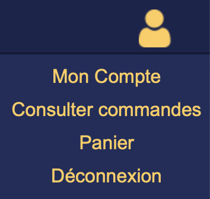
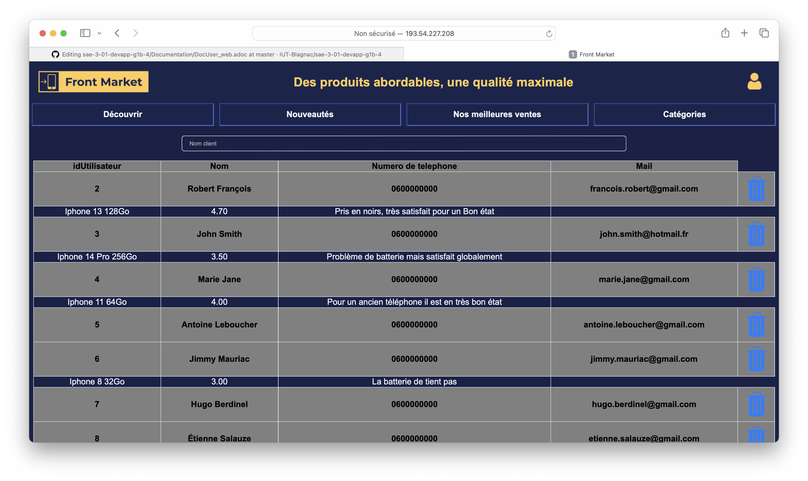

= Documentation Utilisateur site Web
:toc:
:toc-title: Sommaire

Version du site : 6 +
Date : 10/01/2024 +
Equipe : 1B-4 +
Client : Front Maker +
Projet : Site Web e-commerce + 

<<<

== 1. Description du Projet
=== a) Equipe

Scrum Master : https://github.com/bastos-rcd[Bastien Record] +
Product Owner : https://github.com/walaedinesekoub[Waleidine Sekoub] +
Développeurs : https://github.com/HugolaLicorne[Hugo Berdinel], https://github.com/technox023[Éliot Desportes], https://github.com/GuiSamSamTei[Guilherme Sampaio] +

=== b) Contexte du projet

Front Market est une entreprise spécialisée dans la distribution de produits électroniques reconditionnés. Notre mission est de rendre la technologie accessible à tous, en offrant une gamme diversifiée de produits électroniques de bonne qualité, le tout à des tarifs abordables. Chez Front Market, nous pensons fermement que la technologie doit être accessible au grand public.

=== c) Objectifs du projet

L’objectif est de créer un site web en accord avec la charte graphique de l’entreprise, qui proposera des produits reconditionnés. Front Market et ses produits s’adressent à tout type de clients, aussi bien pour des usages professionnels ou particuliers.

== 2. Consulter le site web
=== a) Prérequis

Il est nécessaire d’avoir une connexion internet et un navigateur pour accéder au site. Afin d’accéder à son compte il faut en avoir déjà créé un, sinon il sera possible d’en créer un sur le site.

=== b) Aller sur le site

Cliquez sur http://193.54.227.208/~saephp04[ce lien] pour accéder au site web de Front Maker.

== 3. Utiliser le site Web

=== a) Rôles

Il y a 3 rôles différents pour les utilisateurs du site qui sont : +

* l'*utilisateur non connecté* : il peut visualiser les différentes produits présents sur le siteainsi que ses caractéristiques et voir les différentes informations consernant l'entreprise *Front Market* +
* l'*utilisateur connecté* : il peut faire tout ce qu’un *utilisateur non connecté* fait et en plus visualiser ses informations de compte et les modifier, ajouter des produits au panier et le consulter, ajouter un avis sous un produit, se déconnecter, commander et payer +
* l'*administrateur* : il peut ajouter et modifier un produits sur le site, il peut répondre aux avis des clients sur les produits mais aussi gérer les comptes des clients pour éventuellement en clôturer un d'entre eux +

=== b) Utilisateur non connecté

==== Consulter produit

Pour consulter un produit, on peut visualiser par la page d'accueil ou bien la page boutique. +

==== Trier les produits

Il est possible de trier les produits selon différents critères afin de faciliter la recherche en utiliser la barre de menu ou une option de filtrage.

`Découvrir` affiche les produit sans ordre de trie +
`Nouveautés` afficher les produits dans l'ordre des sorties les plus récentes +
`Nos meilleures ventes` affiche les produits dans l'odre des meilleures notes +
`Catégories` affiche un menu déroulant afin de choisir la catégorie ou la sous-catégorie à sélectionner +

`Prix` permet de choisir une marge de prix pour trier les produits parmis la liste +
`Marque` permet de choisir la marque pour afficher seulement les produits d'une certaines marque +
`Promos` permet de trier les produits par ordre de prix décroissant ou croissant +

==== Consulter un produit

Pour consulter un produit l'utilisateur doit cliquer sur un produit pour être redirigé vers la page d'affichage des informations +

Il peut voir les avis des différents clients +

==== Contacter l'entreprise

Un utilisateur peut contacter l'entreprise Front Market grâce aux informations présentent sur la quasi totalité des pages +

image::Resources/contact.png[]

==== Connexion / Inscription

Il est possible de se connecter ou de créer un compte en accédents au menu déroulant sur l'icon en haut à droite de la page +

Il accède ensuite à deux formulaires pour créer un compte ou s'y connecter +

=== c) Utilisateur connecté

==== Se déconnecter

Il est possible de se déconnecter en accédant à l'icon en haut à droite de la page. +

==== Consulter et modifier informations de compte

L'utilisateur connecté peut accéder à ses informations, à partir de la même icon précédente, afin de modifier ou seulement consulter ses informations. Si des champs on été modifié alors il faut cliquer sur le bouton `Modifier`. +

image::Resources/gestion_compte.png[]

==== Ajouter des produits au panier

Il est possible d'ajouter des produits au panier en cliquant sur le bouton `Ajouter au panier` dans la page du produit concerné en choisissant ses caractéristiques. +

==== Consulter le panier et modifier le panier

Il est possible d'accéder à son panier en cliquant sur l'icon en haut à droite de la page. +
L'utilisateur peut augmenter la quantité du produit voulu en cliquant sur le bouton `+`, ou bien diminuer la quantité en cliquant sur le bouton `-`, ou bien supprimer le produit du panier en cliquant sur la poubelle. +

==== Commander et payer

Pour commander et payer, l'utilisateur doit cliquer sur `Valider mon panier`. Il sera redirigé sur la page de paiement afin de compléter les différentes informations de livraison et de paiement. En cliquant sur `Valider` la commande se valide. +

==== Consulter mes commandes

Il est possible de consulter ses dernières commandes afin de visualiser le prix mais aussi les différentes produits et leur quantité commandé. +

==== Ajouter un avis

L'utilisateur peut ajouter un avis (seulement un) sous chaque produit afin de montrer aux autres utilisateurs différentes remarques et la note du produit. +
Sur cette même page un peut également consulter les différents avis des autres clients. +

=== d) Administrateur

==== Ajouter un produit

L'administrateur à la possibilité d'ajouter un produit sur le site afin de le mettre en vente. Pour cela il doit se rendre dans le menu en haut à droite de l'écran puis cliquer sur `Ajouter un produit`. +

Il doit ensuite remplir le formulaire pour insérer le produit sur le site. +

==== Modifier un produit

L'administrateur à la possibilité de modifier un produit présent sur le site afin d'ajouter du stock ou de modifier son prix ainsi que son solde en %. Pour cela il doit se rendre dans le menu en haut à droite de l'écran puis cliquer sur `Gestion des produits`. +

==== Supprimer un client

L'administrateur à la possibilité de un compte client si son activité sur le site est mal intentionné. Pour cela il doit se rendre dans le menu en haut à droite de l'écran puis cliquer sur `Gestion des clients`. +
Il peut voir les différents avis que le client à laisser sur chaque produit. +

==== Répondre à un avis

L'administrateur à la possibilité de répondre à un avis afin de donner une réponse constructive à la demande de l'utilisateur. Pour cela il doit se rendre sur le produit et visualiser les différents avis. Si l'avis n'a pas de réponse alors un formulaire s'affichera afin d'y ajouter la réponse. +

image::Resources/rep_avis.png[]
